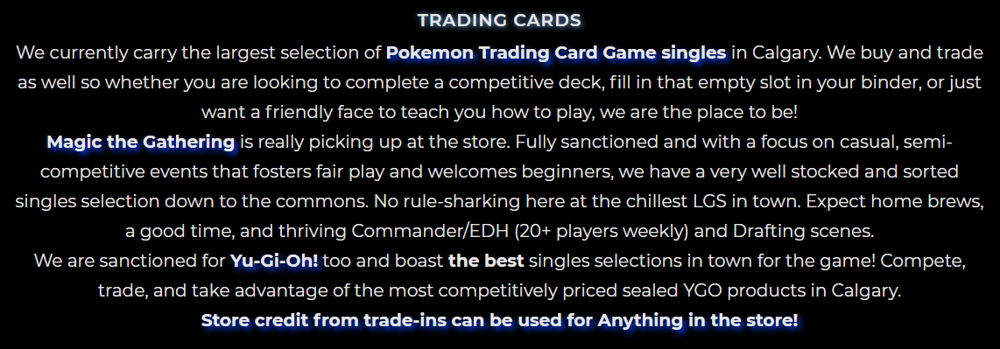

# Website Critique - ShoeBox Games & Cafe
ShoeBox is a little cafe that offers a place to play boardgames, and sell boardgames and models in the meantime. 
> Whether you’re looking for a hang-out after school with your buddies, a place where you can pick up a new board game for your kids, or a night out with close friends over foods and cards, ShoeBox Games & Cafe is the place to be. We’ll provide the games and addictive snacks and desserts.  You can bring your family board game nights, kitchen table top adventures, and epic tournament games! (Owner Pat)

So the website should be focus on showing all these features to its clients. The [current website](https://www.shoeboxgc.com/) works fine for now, but there are still some place need to be improved.

## Website in General
1. The **repetition** of the website is good. The website looks quite neat and comfortable, because the main colors are unified, and the fonts are very similar.
2. Everypage is filled up with words and images. There is not much **negative space** through the whole website, which makes the pages difficult to scan and read.
3. I know black sometimes brings a sense of mystery, and this maybe why they choose black as **background color**, but ShoeBox is a boardgame cafe with a lot of fun. Black seems too heavy for a place like this, so they may consider changing the background color to a lighter one, like grey or light blue.
4. Most of the **photos** on this website are either close shot or from a weired angle. It will easily makes the user fell oppression, espicially when the backgroud is black.
5. The **fonts and size** for most of both titles and texts are very similar, which makes the words not scanable.

## Homepage
1. Nivagation Bar

  - The *navigation bar* is automatically adjusted when changing the size of the browser.
  - The *Shop* button showing besides Logo leads to the same page page as the *Webstore* on the nivagation bar dose. It is weired and confused.
  - There are 6 buttons on the navigation bar right now. If they can add or remove one, it will follow the **Rule of Odds**.
  - The *search bar* is not adjusted when changing the size of the browser.

2. Announcement Section

  - All the three annoucements are using the same **font and size**. It is difficult to notice the most inportation note, which should be *WE ARE OPEN FOR BUSINESS*. It will be better if increasing the size of this sentence.
  - These are too much colors here. It is hard to identify what is the most important message that the users should be looking for.

3. Information Section  

  

  - They use some highlignt words here, which is good. But the paragraph is still too long to scan. If they can add some white space between sentences or paragraphs, it will be better.
  - If they can change the title to a bigger size and other text can be smaller, it will be easier for scanning the whole paragraph.

## Shop Page

- The layout of the names and prices maybe confused sometimes. If can change to up-down, or left-right layout, the pages will look much more neat.

## Mobile Friendliness
- The website is automatically adjusted well when change the browser's size, but is not work well in the mobile unexpectedly. The navigation bar is not showing correctly. But besides this, everything else looks good on the homepage.
- It is suprised to say that the shop page on mobile looks better than on computer, because prices' size and color is different than names'. It makes obvious to the user what they should be paying attention to.
- Based on my usage experiences, there is not any phone-specific features using in this website.

